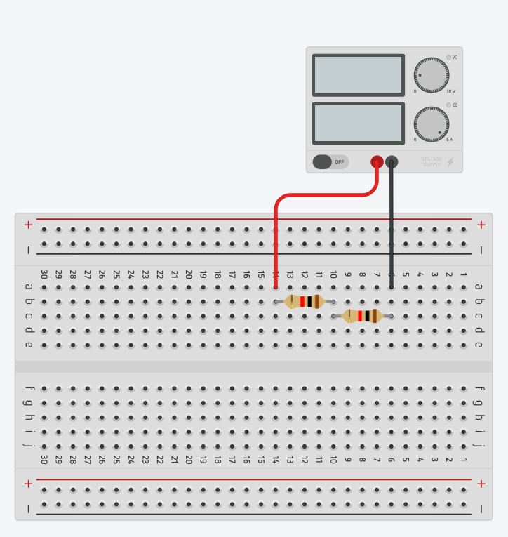

# Goal 
Find the voltage across the resistors, individually and together. 

# Circuit

# Points to think about 
1. How are the holes on the breadboard connected? How would you go about finding this out with only a wire and a multimeter?
2. Do the voltages measured line-up with what you expected? 
3. How would you measure the current flow across the resistors? 

