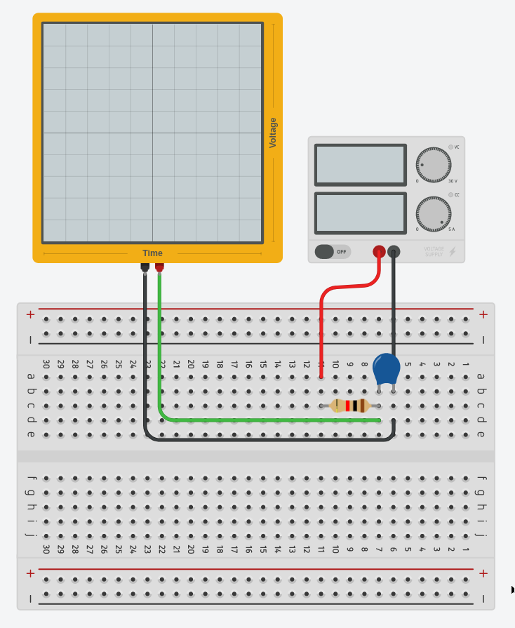

# Goal 
Observe the charging curve of a capacitor.

# Circuit

# Points to think about
1. How long did it take for the capacitor to charge? 
2. You're only interested in measuring the charging of the capacitor. Is there a way to **only measure this** on the oscilloscope?
