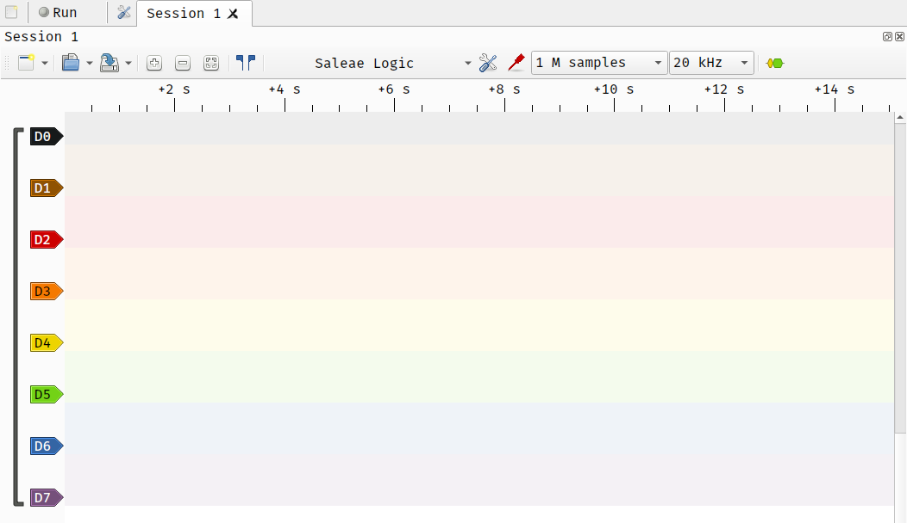

# What is it? 
A measurement device which is very similar to an oscilloscope, but it designed to only measure **digital** signals. These devices are usually much more accessible than an oscilloscopes due to its significantly lower price (~10 SGD), and are invaluable for investigating communication protocols such as UART, I2C and SPI. 

The majority of logic analyser do not come with a display built in, and instead need to be connected to a computer to view the results. The [sigrok](https://sigrok.org/wiki/Main_Page) project is an open-source project designed to interface with different measurement devices, including logic analysers. This would allow you to interface your 10 SGD analyser with a robust front-end, which would usually be locked behind a paywall to the tune of a few hundred dollars. 

