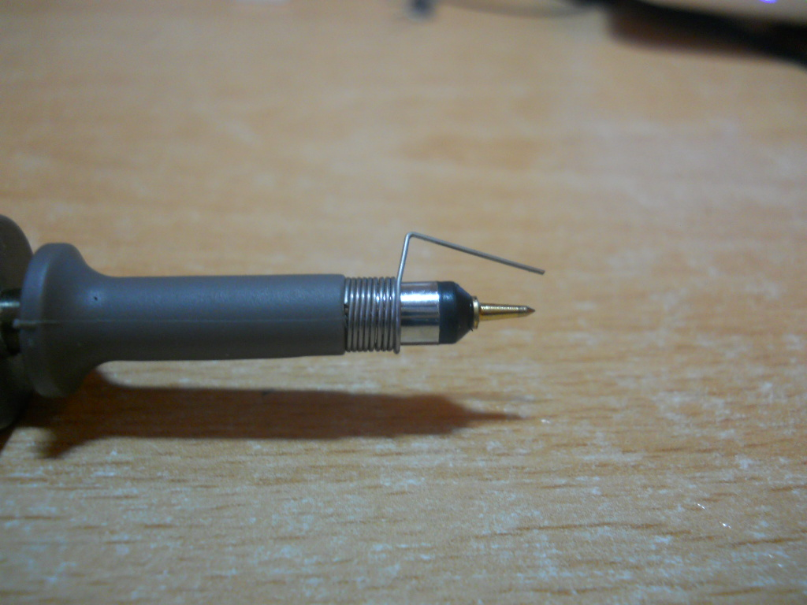

# What is it? 
It is a measurement device which is measures the voltage across two points. Although this may seem similar to a voltmeter, an oscilloscope does this **extremely** quickly, allowing it to plot voltage graphs against time with small time steps. 

This makes scopes brilliant for observing fast moving digital and analog signals, commonly found in communication lines or in fast switching circuits. 

The resolution (the size of the time step) of an oscilloscope varies and is dependent on the scope being used. Always refer to the manual and specification sheet of your scope to learn its limitations. 

# Display 
The oscilloscopes display has voltage on the vertical axis and time on the horizontal axis. 

The display itself is broken up into a grid. Each square on the grid has two divisions, the vertical and horizontal division. The vertical and horizontal divisions are sometimes referred to as voltage and time divisions respectively, due to the axis positions. The exact units of these divisions are generally displayed at the top or bottom of the scopes display. (hint: when first using your scope, turn the knobs to see what changes!)

# Channels 
Oscilloscopes can have multiple channels for taking measurements. A 3 channel scope will be able to measure 3 different signals at same time, overlaying them on top of each other on the display. 

Individual channels can be toggled on and off, depending on what the user is observe from the DUT. Care should be taken to make sure the channel being display corresponds to the channel being used for measurement. 

# Probes 
Probes are connected to the channel ports of an oscilloscope. Each probe has a ground clip as well a hook for taking measurements. 

When taking measurements across very metal contacts, the hook attachment can be removed, revealing a fine metal tip for taking measurements on small traces! Additionally, the ground clip can be switch out for a fix distance tip too.

Below is an image of a probe which has had the hook removed and the fixed ground tip attached. 

[Source](https://electronics.stackexchange.com/questions/411399/how-the-low-inductance-of-short-ground-clip-probes-prevents-interference)

Finally, some probes come included with a slider marked with 1x and 10x on either end. 1x and 10x refers to the input impedance (resistance) of the scope, with the 10x mode increasing the input impedance of the probe by 10 times. This will result in a cleaner measurement, but with the downside that the measured voltage will be 10 times smaller than what it actually is. Because of this, small signals might become too small to be measured by the scope.  The choice of mode should be dependent on the DUT and is up to the user. 

# All the buttons 
Scopes have...a lot of buttons. The two basic knobs are the horizontal and vertical positioning knobs. These knobs allow you to move your measured signal left, right, up and down. 

The trigger (sometimes called auto-scale or just auto) button is to automatically sync up your scope with the incoming signal, 'calibrating' it. Either than auto-triggering, you can configure your scope to trigger at specific types of signals. Find out more [here](./scope_triggering.md). 

The rest of the buttons on the scope are dependent on the specific model, but they allow you to interface with the different measurement modes of the scope, such as frequency, pulse width modulation, peak-to-peak, maximum, minimum, mean and so on. Nearly every scope comes with a 'manual measurement' mode, in the form of cursors. Cursors are lines which you can move across your scopes display to help you calculate changes between two points, either in the voltage or time scale. 

The best way to figure out what the buttons on your scope is to click them and see what happens, so don't be afraid to do so. (reading the manual for your scope also helps)

