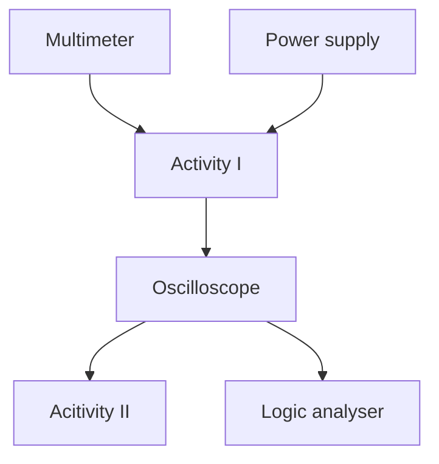

This course is an introduction to basic electronic test equipment commonly used in building and debugging circuits. In addition, the reader will also become familiar with the usage of breadboards, a common circuit prototyping material. 

The test equipment covered will include multimeters, DC power supplies and oscilloscopes, with a short section on logic analysers. 

Although this course material can be consumed without having the above equipment, it is still **recommended** to have a set on-hand for the full experience. The best way to learn how to use electronic equipment is to keep using them! (press all the buttons)

If you have any feedback on the content presented here or find any mistakes, please reach out to jasshank@u.nus.edu!

# Recommended reading guide

